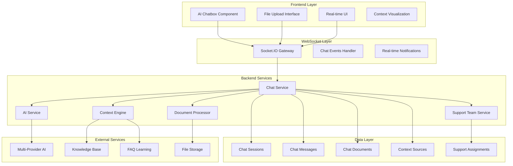

# Design Document

## Overview

Bu tasarım, mevcut destek merkezi sistemine entegre edilecek kapsamlı bir AI destekli chatbox sistemi için mimari ve implementasyon detaylarını içerir. Sistem, real-time mesajlaşma, dosya işleme, URL analizi, multi-provider AI entegrasyonu ve support team ile canlı iletişim özelliklerini sunacaktır.

## Architecture

### High-Level Architecture



### System Components

#### 1. Frontend Components

**AI Chatbox Component**
- Modern, responsive chat interface
- Real-time message streaming
- File upload with drag & drop
- URL input and processing
- Context source citations
- Typing indicators
- Message history
- Mobile-optimized design

**Chat Context Provider**
- Context state management
- File upload handling
- URL processing coordination
- Knowledge base integration
- Real-time updates

#### 2. Backend Services

**Chat Service**
- Chat session management
- Message routing and storage
- Context coordination
- AI response generation
- Support team integration

**Context Engine**
- Multi-source context building
- Relevance scoring
- Content indexing
- Search optimization

**Document Processor**
- Multi-format file processing
- Text extraction
- Metadata generation
- Content indexing

**AI Service (Enhanced)**
- Multi-provider support
- Context-aware responses
- Streaming responses
- Provider failover

## Components and Interfaces

### Database Schema

```sql
-- Chat Sessions
CREATE TABLE chat_sessions (
    id UUID PRIMARY KEY DEFAULT gen_random_uuid(),
    user_id UUID NOT NULL REFERENCES users(id),
    session_type VARCHAR(20) NOT NULL DEFAULT 'support', -- 'support', 'general'
    status VARCHAR(20) NOT NULL DEFAULT 'active', -- 'active', 'closed', 'transferred'
    title VARCHAR(255),
    metadata JSONB DEFAULT '{}',
    created_at TIMESTAMP DEFAULT NOW(),
    updated_at TIMESTAMP DEFAULT NOW(),
    closed_at TIMESTAMP,
    
    INDEX idx_chat_sessions_user_id (user_id),
    INDEX idx_chat_sessions_status (status),
    INDEX idx_chat_sessions_type (session_type),
    INDEX idx_chat_sessions_created (created_at)
);

-- Chat Messages
CREATE TABLE chat_messages (
    id UUID PRIMARY KEY DEFAULT gen_random_uuid(),
    session_id UUID NOT NULL REFERENCES chat_sessions(id) ON DELETE CASCADE,
    sender_type VARCHAR(20) NOT NULL, -- 'user', 'ai', 'support'
    sender_id UUID, -- NULL for AI, user_id for user/support
    content TEXT NOT NULL,
    message_type VARCHAR(20) DEFAULT 'text', -- 'text', 'file', 'url', 'system'
    metadata JSONB DEFAULT '{}', -- AI model, processing time, etc.
    created_at TIMESTAMP DEFAULT NOW(),
    
    INDEX idx_chat_messages_session (session_id),
    INDEX idx_chat_messages_sender (sender_type, sender_id),
    INDEX idx_chat_messages_created (created_at)
);

-- Chat Documents
CREATE TABLE chat_documents (
    id UUID PRIMARY KEY DEFAULT gen_random_uuid(),
    session_id UUID NOT NULL REFERENCES chat_sessions(id) ON DELETE CASCADE,
    message_id UUID REFERENCES chat_messages(id) ON DELETE CASCADE,
    filename VARCHAR(255) NOT NULL,
    file_type VARCHAR(10) NOT NULL,
    file_size INTEGER NOT NULL,
    storage_path VARCHAR(500) NOT NULL,
    extracted_content TEXT,
    processing_status VARCHAR(20) DEFAULT 'pending', -- 'pending', 'processing', 'completed', 'failed'
    metadata JSONB DEFAULT '{}',
    created_at TIMESTAMP DEFAULT NOW(),
    processed_at TIMESTAMP,
    
    INDEX idx_chat_documents_session (session_id),
    INDEX idx_chat_documents_status (processing_status)
);

-- Chat Context Sources
CREATE TABLE chat_context_sources (
    id UUID PRIMARY KEY DEFAULT gen_random_uuid(),
    session_id UUID NOT NULL REFERENCES chat_sessions(id) ON DELETE CASCADE,
    message_id UUID REFERENCES chat_messages(id) ON DELETE CASCADE,
    source_type VARCHAR(30) NOT NULL, -- 'knowledge_base', 'faq_learning', 'document', 'url'
    source_id VARCHAR(255), -- KB article ID, FAQ entry ID, document ID, URL
    content TEXT NOT NULL,
    relevance_score FLOAT NOT NULL DEFAULT 0.0,
    metadata JSONB DEFAULT '{}',
    created_at TIMESTAMP DEFAULT NOW(),
    
    INDEX idx_chat_context_session (session_id),
    INDEX idx_chat_context_type (source_type),
    INDEX idx_chat_context_relevance (relevance_score)
);

-- Support Team Assignments
CREATE TABLE chat_support_assignments (
    id UUID PRIMARY KEY DEFAULT gen_random_uuid(),
    session_id UUID NOT NULL REFERENCES chat_sessions(id) ON DELETE CASCADE,
    support_user_id UUID NOT NULL REFERENCES users(id),
    assigned_by UUID REFERENCES users(id),
    assignment_type VARCHAR(20) NOT NULL DEFAULT 'manual', -- 'manual', 'auto', 'escalated'
    status VARCHAR(20) NOT NULL DEFAULT 'active', -- 'active', 'completed', 'transferred'
    assigned_at TIMESTAMP DEFAULT NOW(),
    completed_at TIMESTAMP,
    notes TEXT,
    
    INDEX idx_chat_assignments_session (session_id),
    INDEX idx_chat_assignments_support (support_user_id),
    INDEX idx_chat_assignments_status (status)
);

-- URL Processing Cache
CREATE TABLE chat_url_cache (
    id UUID PRIMARY KEY DEFAULT gen_random_uuid(),
    url_hash VARCHAR(64) UNIQUE NOT NULL,
    original_url TEXT NOT NULL,
    title VARCHAR(500),
    content TEXT,
    metadata JSONB DEFAULT '{}',
    processing_status VARCHAR(20) DEFAULT 'completed',
    created_at TIMESTAMP DEFAULT NOW(),
    expires_at TIMESTAMP,
    
    INDEX idx_chat_url_hash (url_hash),
    INDEX idx_chat_url_expires (expires_at)
);
```

### API Interfaces

#### Chat Service Interface

```typescript
interface ChatService {
  // Session Management
  createSession(userId: string, type: 'support' | 'general'): Promise<ChatSession>;
  getSession(sessionId: string): Promise<ChatSession>;
  getUserSessions(userId: string): Promise<ChatSession[]>;
  closeSession(sessionId: string): Promise<void>;
  
  // Message Handling
  sendMessage(sessionId: string, message: CreateMessageDto): Promise<ChatMessage>;
  getMessages(sessionId: string, pagination: PaginationDto): Promise<ChatMessage[]>;
  
  // AI Integration
  generateAIResponse(sessionId: string, userMessage: string): Promise<ChatMessage>;
  
  // Support Team
  assignSupport(sessionId: string, supportUserId: string): Promise<void>;
  transferSession(sessionId: string, newSupportUserId: string): Promise<void>;
}
```

#### Context Engine Interface

```typescript
interface ChatContextEngine {
  buildContext(query: string, sessionId: string): Promise<ContextResult>;
  searchKnowledgeBase(query: string, limit: number): Promise<KnowledgeBaseResult[]>;
  searchFaqLearning(query: string, limit: number): Promise<FaqLearningResult[]>;
  searchDocuments(query: string, sessionId: string, limit: number): Promise<DocumentResult[]>;
  processUrl(url: string): Promise<UrlResult>;
  
  // Context scoring and ranking
  scoreRelevance(content: string, query: string): Promise<number>;
  rankSources(sources: ContextSource[], query: string): Promise<ContextSource[]>;
}
```

#### Document Processor Interface

```typescript
interface DocumentProcessor {
  processDocument(file: Buffer, filename: string, sessionId: string): Promise<ProcessedDocument>;
  extractText(file: Buffer, fileType: string): Promise<string>;
  generateMetadata(content: string, filename: string): Promise<DocumentMetadata>;
  
  // Supported formats
  supportedFormats: string[]; // ['pdf', 'docx', 'xlsx', 'txt', 'md']
}
```

### WebSocket Events

```typescript
// Client to Server Events
interface ClientToServerEvents {
  'join-session': (sessionId: string) => void;
  'send-message': (data: SendMessageData) => void;
  'upload-file': (data: FileUploadData) => void;
  'process-url': (data: UrlProcessData) => void;
  'typing-start': (sessionId: string) => void;
  'typing-stop': (sessionId: string) => void;
}

// Server to Client Events
interface ServerToClientEvents {
  'message-received': (message: ChatMessage) => void;
  'ai-response-start': (sessionId: string) => void;
  'ai-response-chunk': (data: { sessionId: string; chunk: string }) => void;
  'ai-response-complete': (message: ChatMessage) => void;
  'file-processing-status': (data: FileProcessingStatus) => void;
  'url-processing-status': (data: UrlProcessingStatus) => void;
  'support-joined': (data: SupportJoinedData) => void;
  'support-left': (data: SupportLeftData) => void;
  'typing-indicator': (data: TypingIndicatorData) => void;
  'session-updated': (session: ChatSession) => void;
}
```

## Data Models

### Core Entities

```typescript
// Chat Session Entity
@Entity('chat_sessions')
export class ChatSession extends BaseEntity {
  @Column('uuid')
  userId: string;
  
  @Column({ type: 'enum', enum: ['support', 'general'], default: 'support' })
  sessionType: 'support' | 'general';
  
  @Column({ type: 'enum', enum: ['active', 'closed', 'transferred'], default: 'active' })
  status: 'active' | 'closed' | 'transferred';
  
  @Column({ nullable: true })
  title: string;
  
  @Column('jsonb', { default: {} })
  metadata: {
    aiProvider?: string;
    modelUsed?: string;
    contextSources?: number;
    messageCount?: number;
    supportAssigned?: boolean;
    customerSatisfaction?: number;
  };
  
  @Column({ type: 'timestamp', nullable: true })
  closedAt: Date;
  
  @OneToMany(() => ChatMessage, message => message.session)
  messages: ChatMessage[];
  
  @OneToMany(() => ChatDocument, document => document.session)
  documents: ChatDocument[];
  
  @OneToMany(() => ChatSupportAssignment, assignment => assignment.session)
  supportAssignments: ChatSupportAssignment[];
}

// Chat Message Entity
@Entity('chat_messages')
export class ChatMessage extends BaseEntity {
  @ManyToOne(() => ChatSession, session => session.messages)
  session: ChatSession;
  
  @Column('uuid')
  sessionId: string;
  
  @Column({ type: 'enum', enum: ['user', 'ai', 'support'] })
  senderType: 'user' | 'ai' | 'support';
  
  @Column('uuid', { nullable: true })
  senderId: string;
  
  @Column('text')
  content: string;
  
  @Column({ type: 'enum', enum: ['text', 'file', 'url', 'system'], default: 'text' })
  messageType: 'text' | 'file' | 'url' | 'system';
  
  @Column('jsonb', { default: {} })
  metadata: {
    aiModel?: string;
    processingTime?: number;
    contextSources?: string[];
    confidence?: number;
    supportUserId?: string;
    supportUserName?: string;
  };
  
  @OneToMany(() => ChatContextSource, source => source.message)
  contextSources: ChatContextSource[];
}
```

## Error Handling

### Error Categories

1. **Connection Errors**
   - WebSocket disconnection
   - Network timeouts
   - Server unavailability

2. **Processing Errors**
   - File processing failures
   - URL scraping errors
   - AI provider failures

3. **Validation Errors**
   - Invalid file formats
   - File size limits
   - Malformed URLs

4. **Authorization Errors**
   - Session access denied
   - Support team permissions
   - Rate limiting

### Error Handling Strategy

```typescript
// Error Response Interface
interface ChatErrorResponse {
  error: {
    code: string;
    message: string;
    details?: any;
    retryable: boolean;
    timestamp: Date;
  };
}

// Error Codes
enum ChatErrorCode {
  // Connection
  CONNECTION_LOST = 'CONNECTION_LOST',
  SESSION_EXPIRED = 'SESSION_EXPIRED',
  
  // Processing
  FILE_PROCESSING_FAILED = 'FILE_PROCESSING_FAILED',
  URL_PROCESSING_FAILED = 'URL_PROCESSING_FAILED',
  AI_PROVIDER_ERROR = 'AI_PROVIDER_ERROR',
  
  // Validation
  INVALID_FILE_FORMAT = 'INVALID_FILE_FORMAT',
  FILE_TOO_LARGE = 'FILE_TOO_LARGE',
  INVALID_URL = 'INVALID_URL',
  
  // Authorization
  ACCESS_DENIED = 'ACCESS_DENIED',
  RATE_LIMITED = 'RATE_LIMITED'
}
```

## Testing Strategy

### Unit Tests

1. **Service Layer Tests**
   - Chat service methods
   - Context engine algorithms
   - Document processor functions
   - AI service integration

2. **Entity Tests**
   - Data validation
   - Relationship integrity
   - Computed properties

3. **Utility Tests**
   - Text extraction
   - URL validation
   - Context scoring

### Integration Tests

1. **API Endpoint Tests**
   - Chat session management
   - Message sending/receiving
   - File upload/processing
   - Support team operations

2. **WebSocket Tests**
   - Real-time messaging
   - Event handling
   - Connection management

3. **Database Tests**
   - Entity relationships
   - Query performance
   - Data consistency

### End-to-End Tests

1. **User Workflows**
   - Complete chat sessions
   - File upload and processing
   - URL sharing and analysis
   - Support team handoff

2. **AI Integration Tests**
   - Multi-provider responses
   - Context-aware answers
   - Error handling and fallbacks

3. **Performance Tests**
   - Concurrent chat sessions
   - Large file processing
   - Real-time message throughput

### Test Data Strategy

```typescript
// Test Fixtures
const testChatSession = {
  userId: 'test-user-id',
  sessionType: 'support',
  status: 'active',
  metadata: {
    aiProvider: 'openai',
    modelUsed: 'gpt-4o'
  }
};

const testMessage = {
  sessionId: 'test-session-id',
  senderType: 'user',
  content: 'Test message content',
  messageType: 'text'
};

const testDocument = {
  sessionId: 'test-session-id',
  filename: 'test-document.pdf',
  fileType: 'pdf',
  fileSize: 1024000,
  extractedContent: 'Extracted text content...'
};
```

## Implementation Phases

### Phase 1: Core Chat Infrastructure (Week 1)
- Database schema creation
- Basic chat entities
- WebSocket gateway setup
- Simple message sending/receiving
- Session management

### Phase 2: AI Integration (Week 1-2)
- AI service enhancement
- Context engine basic implementation
- Knowledge base integration
- FAQ learning integration
- Multi-provider support

### Phase 3: Document Processing (Week 2)
- File upload handling
- Document processor implementation
- Text extraction for PDF, DOCX, XLSX, TXT, MD
- File storage integration
- Processing status tracking

### Phase 4: URL Processing (Week 2)
- URL validation and scraping
- Content extraction
- Caching mechanism
- Error handling

### Phase 5: Support Team Integration (Week 3)
- Support assignment system
- Real-time notifications
- Chat transfer functionality
- Support dashboard integration

### Phase 6: Frontend Components (Week 3-4)
- AI Chatbox component
- File upload interface
- Real-time messaging UI
- Context visualization
- Mobile responsiveness

### Phase 7: General Communication Module (Week 4)
- Customer role integration
- General chat context
- Platform information responses
- Support escalation from general chat

### Phase 8: Testing & Polish (Week 4-5)
- Comprehensive testing
- Performance optimization
- Error handling refinement
- Documentation completion

## Security Considerations

1. **Authentication & Authorization**
   - JWT token validation
   - Session ownership verification
   - Support team role checks

2. **File Upload Security**
   - File type validation
   - Virus scanning
   - Size limitations
   - Secure storage

3. **URL Processing Security**
   - URL validation
   - Robots.txt compliance
   - Rate limiting
   - Content sanitization

4. **Data Privacy**
   - Message encryption at rest
   - PII detection and masking
   - GDPR compliance
   - Data retention policies

## Performance Optimization

1. **Caching Strategy**
   - URL content caching
   - Context search results
   - AI response caching
   - Session state caching

2. **Database Optimization**
   - Proper indexing
   - Query optimization
   - Connection pooling
   - Read replicas for search

3. **Real-time Performance**
   - WebSocket connection pooling
   - Message batching
   - Efficient event handling
   - Memory management

4. **AI Response Optimization**
   - Response streaming
   - Context size optimization
   - Provider load balancing
   - Fallback mechanisms