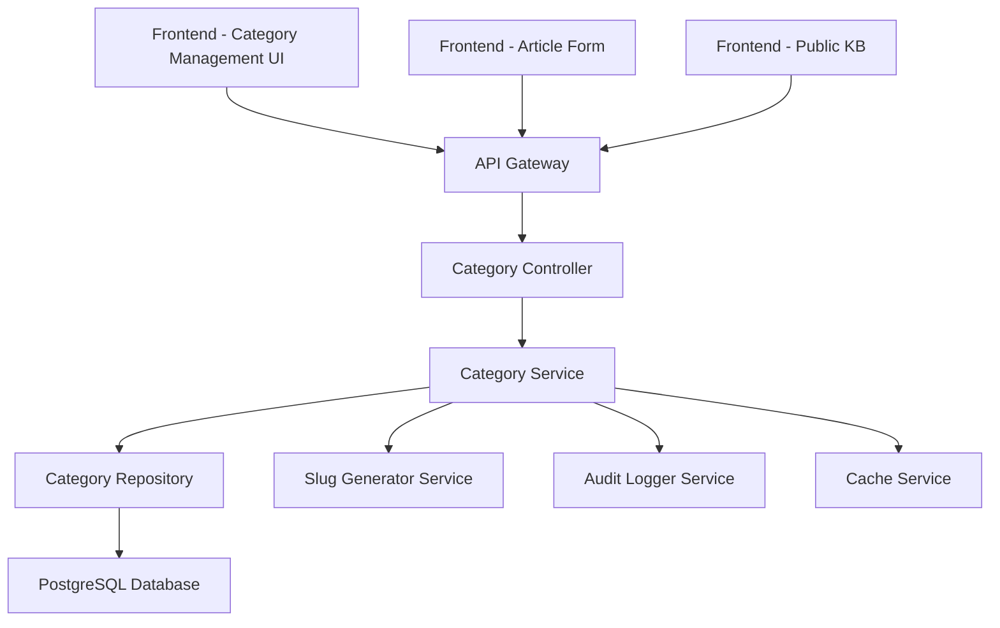

# Dinamik Knowledge Base Kategori Sistemi - Tasarım

## Genel Bakış

Bu tasarım, Knowledge Base makalelerini organize etmek için esnek, ölçeklenebilir ve kullanıcı dostu bir kategori sistemi sunar. Sistem, hiyerarşik kategori yapısı, görsel kimlik yönetimi, otomatik slug oluşturma ve performans optimizasyonları içerir.

## Mimari

### Sistem Bileşenleri



### Veri Akışı

1. **Kategori Oluşturma**: UI → Controller → Service → Repository → Database
2. **Kategori Listeleme**: Cache → Service → Repository → Database (cache miss durumunda)
3. **Hiyerarşi Yönetimi**: Service katmanında business logic ile kontrol
4. **Makale İlişkilendirme**: Article Service ile Category Service entegrasyonu

## Bileşenler ve Arayüzler

### Backend Bileşenleri

#### 1. KnowledgeBaseCategoryEntity
```typescript
interface KnowledgeBaseCategoryEntity {
  id: string;
  name: string;
  slug: string;
  description?: string;
  color: string;
  icon: string;
  sortOrder: number;
  isActive: boolean;
  parentId?: string;
  parent?: KnowledgeBaseCategoryEntity;
  children?: KnowledgeBaseCategoryEntity[];
  articleCount?: number;
  createdAt: Date;
  updatedAt: Date;
  createdBy: string;
  updatedBy: string;
}
```

#### 2. KnowledgeBaseCategoryService
```typescript
interface CategoryServiceInterface {
  // CRUD Operations
  createCategory(dto: CreateCategoryDto): Promise<CategoryEntity>;
  updateCategory(id: string, dto: UpdateCategoryDto): Promise<CategoryEntity>;
  deleteCategory(id: string): Promise<void>;
  getCategory(id: string): Promise<CategoryEntity>;
  
  // Hierarchy Management
  getCategoriesWithCounts(): Promise<CategoryEntity[]>;
  getCategoryTree(): Promise<CategoryTreeNode[]>;
  moveCategory(id: string, newParentId?: string): Promise<void>;
  
  // Utility Methods
  generateSlug(name: string): Promise<string>;
  validateHierarchy(categoryId: string, parentId?: string): Promise<boolean>;
  reorderCategories(categoryIds: string[]): Promise<void>;
  
  // Statistics
  getCategoryStats(): Promise<CategoryStats>;
  getPopularCategories(limit: number): Promise<CategoryEntity[]>;
}
```

#### 3. KnowledgeBaseCategoryController
```typescript
interface CategoryControllerInterface {
  // REST Endpoints
  POST /knowledge-base/categories
  GET /knowledge-base/categories
  GET /knowledge-base/categories/:id
  PUT /knowledge-base/categories/:id
  DELETE /knowledge-base/categories/:id
  
  // Special Operations
  POST /knowledge-base/categories/initialize
  PUT /knowledge-base/categories/reorder
  GET /knowledge-base/categories/tree
  GET /knowledge-base/categories/stats
}
```

### Frontend Bileşenleri

#### 1. Category Management Dashboard
```typescript
interface CategoryManagementProps {
  categories: Category[];
  onCreateCategory: (category: CreateCategoryDto) => void;
  onUpdateCategory: (id: string, category: UpdateCategoryDto) => void;
  onDeleteCategory: (id: string) => void;
  onReorderCategories: (categoryIds: string[]) => void;
}
```

#### 2. Category Form Component
```typescript
interface CategoryFormProps {
  category?: Category;
  parentCategories: Category[];
  availableIcons: IconOption[];
  availableColors: ColorOption[];
  onSubmit: (category: CategoryFormData) => void;
  onCancel: () => void;
}
```

#### 3. Category Tree Component
```typescript
interface CategoryTreeProps {
  categories: CategoryTreeNode[];
  selectedCategoryId?: string;
  onCategorySelect: (categoryId: string) => void;
  onCategoryMove: (categoryId: string, newParentId?: string) => void;
  isDraggable?: boolean;
}
```

## Veri Modelleri

### Database Schema

```sql
CREATE TABLE knowledge_base_categories (
  id UUID PRIMARY KEY DEFAULT gen_random_uuid(),
  name VARCHAR(255) NOT NULL,
  slug VARCHAR(255) UNIQUE NOT NULL,
  description TEXT,
  color VARCHAR(50) NOT NULL DEFAULT 'blue',
  icon VARCHAR(50) NOT NULL DEFAULT 'folder',
  sort_order INTEGER NOT NULL DEFAULT 0,
  is_active BOOLEAN NOT NULL DEFAULT true,
  parent_id UUID REFERENCES knowledge_base_categories(id) ON DELETE SET NULL,
  article_count INTEGER NOT NULL DEFAULT 0,
  created_at TIMESTAMP WITH TIME ZONE DEFAULT NOW(),
  updated_at TIMESTAMP WITH TIME ZONE DEFAULT NOW(),
  created_by UUID NOT NULL REFERENCES users(id),
  updated_by UUID NOT NULL REFERENCES users(id)
);

CREATE INDEX idx_kb_categories_slug ON knowledge_base_categories(slug);
CREATE INDEX idx_kb_categories_parent ON knowledge_base_categories(parent_id);
CREATE INDEX idx_kb_categories_active ON knowledge_base_categories(is_active);
CREATE INDEX idx_kb_categories_sort ON knowledge_base_categories(sort_order);
```

### DTO Definitions

```typescript
interface CreateCategoryDto {
  name: string;
  description?: string;
  color: string;
  icon: string;
  parentId?: string;
  sortOrder?: number;
}

interface UpdateCategoryDto {
  name?: string;
  description?: string;
  color?: string;
  icon?: string;
  parentId?: string;
  sortOrder?: number;
  isActive?: boolean;
}

interface CategoryTreeNode {
  id: string;
  name: string;
  slug: string;
  color: string;
  icon: string;
  articleCount: number;
  children: CategoryTreeNode[];
  level: number;
}
```

## Hata Yönetimi

### Backend Error Handling

```typescript
enum CategoryErrorCodes {
  CATEGORY_NOT_FOUND = 'CATEGORY_NOT_FOUND',
  DUPLICATE_SLUG = 'DUPLICATE_SLUG',
  CIRCULAR_REFERENCE = 'CIRCULAR_REFERENCE',
  MAX_DEPTH_EXCEEDED = 'MAX_DEPTH_EXCEEDED',
  CATEGORY_HAS_ARTICLES = 'CATEGORY_HAS_ARTICLES',
  INVALID_PARENT = 'INVALID_PARENT'
}

interface CategoryError {
  code: CategoryErrorCodes;
  message: string;
  details?: any;
}
```

### Frontend Error Handling

```typescript
interface CategoryErrorState {
  createError?: string;
  updateError?: string;
  deleteError?: string;
  loadError?: string;
}

// Error boundary for category components
class CategoryErrorBoundary extends React.Component {
  // Handle category-specific errors
}
```

## Test Stratejisi

### Backend Testing

#### Unit Tests
- **Service Layer Tests**: Category business logic, hierarchy validation, slug generation
- **Repository Tests**: Database operations, query optimization
- **Controller Tests**: API endpoint behavior, authentication, authorization

#### Integration Tests
- **Database Integration**: Entity relationships, constraints, migrations
- **API Integration**: End-to-end API workflows
- **Cache Integration**: Redis caching behavior

### Frontend Testing

#### Component Tests
- **Category Form**: Form validation, submission, error handling
- **Category Tree**: Drag-and-drop, hierarchy display, selection
- **Category Management**: CRUD operations, state management

#### E2E Tests
- **Category Lifecycle**: Create → Update → Delete workflow
- **Hierarchy Management**: Parent-child relationships, reordering
- **Article Integration**: Category selection in article forms

### Performance Testing

#### Load Testing
- **Concurrent Category Operations**: Multiple users creating/updating categories
- **Large Hierarchy Rendering**: Performance with deep category trees
- **Cache Performance**: Redis cache hit/miss ratios

#### Database Performance
- **Query Optimization**: Index usage, query execution plans
- **Hierarchy Queries**: Recursive queries for category trees
- **Article Count Updates**: Trigger performance for article_count field

## Güvenlik Considerations

### Authentication & Authorization
- **Role-Based Access**: Admin/Editor roles for category management
- **JWT Token Validation**: Secure API access
- **Audit Logging**: Track all category operations

### Data Validation
- **Input Sanitization**: Prevent XSS in category names/descriptions
- **Slug Validation**: Ensure URL-safe slugs
- **Hierarchy Validation**: Prevent circular references and excessive depth

### Rate Limiting
- **API Rate Limits**: Prevent abuse of category endpoints
- **Bulk Operations**: Limit batch category operations

## Performance Optimizations

### Caching Strategy
```typescript
interface CategoryCacheStrategy {
  // Cache category tree for 15 minutes
  categoryTree: CacheConfig<15>;
  
  // Cache individual categories for 30 minutes
  categoryDetails: CacheConfig<30>;
  
  // Cache article counts for 5 minutes
  articleCounts: CacheConfig<5>;
}
```

### Database Optimizations
- **Materialized Path**: Store category paths for faster hierarchy queries
- **Denormalized Counts**: Cache article counts in category table
- **Partial Indexes**: Index only active categories for better performance

### Frontend Optimizations
- **Virtual Scrolling**: Handle large category lists efficiently
- **Lazy Loading**: Load category details on demand
- **Optimistic Updates**: Immediate UI feedback for better UX

## Migration Strategy

### Database Migration
```sql
-- Migration for existing KB articles
UPDATE knowledge_base_articles 
SET category_id = (
  SELECT id FROM knowledge_base_categories 
  WHERE slug = knowledge_base_articles.category
)
WHERE category IS NOT NULL;

-- Add foreign key constraint
ALTER TABLE knowledge_base_articles 
ADD CONSTRAINT fk_kb_articles_category 
FOREIGN KEY (category_id) REFERENCES knowledge_base_categories(id);
```

### Data Migration Plan
1. **Phase 1**: Create category entities from existing string categories
2. **Phase 2**: Update article references to use category IDs
3. **Phase 3**: Remove old category string fields
4. **Phase 4**: Add constraints and optimize indexes

## Monitoring & Analytics

### Metrics to Track
- **Category Usage**: Most/least used categories
- **Hierarchy Depth**: Average and maximum category depth
- **Performance Metrics**: API response times, cache hit rates
- **User Behavior**: Category creation/modification patterns

### Alerting
- **Performance Alerts**: Slow category queries, cache misses
- **Error Alerts**: Failed category operations, validation errors
- **Usage Alerts**: Unusual category creation patterns