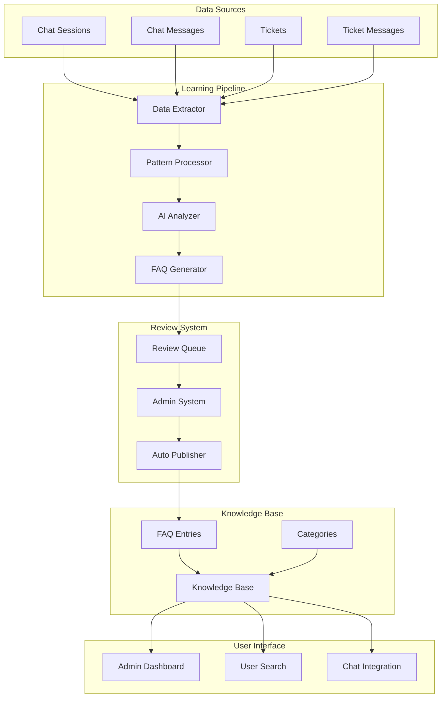

# Self-Learning FAQ Sistemi - Design Document

## Overview

Self-Learning FAQ Sistemi, mevcut chat geçmişi ve çözüme kavuşturulan ticket'lardan AI kullanarak otomatik FAQ oluşturan akıllı bir sistemdir. Sistem, pattern recognition, natural language processing ve machine learning teknikleri kullanarak sürekli öğrenir ve FAQ kalitesini artırır.

## Architecture

### High-Level Architecture



### System Components

#### 1. Data Extraction Layer
- **Chat Data Extractor**: Chat session'ları ve message'ları analiz eder
- **Ticket Data Extractor**: Ticket'ları ve resolution'ları işler
- **Data Normalizer**: Farklı kaynaklardan gelen verileri standartlaştırır

#### 2. AI Processing Layer
- **Pattern Recognition Engine**: Soru-cevap pattern'lerini tespit eder
- **NLP Processor**: Doğal dil işleme ve anlam analizi
- **Similarity Matcher**: Benzer soruları gruplar
- **Confidence Calculator**: FAQ güvenilirlik skorunu hesaplar

#### 3. Learning Management Layer
- **FAQ Generator**: AI analizi sonucu FAQ entry'leri oluşturur
- **Review Queue Manager**: Admin onayı için kuyruğu yönetir
- **Auto Publisher**: Yüksek confidence'lı FAQ'ları otomatik yayınlar
- **Feedback Processor**: Kullanıcı feedback'ini işler

#### 4. Integration Layer
- **Knowledge Base Integrator**: Mevcut KB sistemi ile entegrasyon
- **Category Mapper**: FAQ'ları uygun kategorilere atar
- **Search Enhancer**: Arama sonuçlarını FAQ'larla zenginleştirir

## Components and Interfaces

### Core Entities

#### LearnedFaqEntry Entity
```typescript
interface LearnedFaqEntry {
  id: string;
  question: string;
  answer: string;
  category: string;
  confidence: number; // 1-100
  status: 'draft' | 'pending_review' | 'approved' | 'rejected' | 'published';
  source: 'chat' | 'ticket';
  sourceId: string;
  keywords: string[];
  metadata: {
    originalConversation?: string;
    resolutionTime?: number;
    userSatisfaction?: number;
    similarityScore?: number;
    occurrenceCount?: number;
  };
  createdAt: Date;
  reviewedAt?: Date;
  publishedAt?: Date;
  reviewedBy?: string;
}
```

#### LearningPattern Entity
```typescript
interface LearningPattern {
  id: string;
  patternType: 'question' | 'answer' | 'context';
  pattern: string;
  frequency: number;
  confidence: number;
  keywords: string[];
  category: string;
  sources: Array<{
    type: 'chat' | 'ticket';
    id: string;
    relevance: number;
  }>;
}
```

### Service Interfaces

#### IFaqLearningService
```typescript
interface IFaqLearningService {
  // Data Processing
  processChatSessions(sessionIds: string[]): Promise<LearningPattern[]>;
  processResolvedTickets(ticketIds: string[]): Promise<LearningPattern[]>;
  
  // Pattern Analysis
  analyzePatterns(patterns: LearningPattern[], aiProvider?: 'openai' | 'anthropic' | 'google' | 'openrouter'): Promise<LearnedFaqEntry[]>;
  calculateConfidence(entry: LearnedFaqEntry): Promise<number>;
  
  // FAQ Management
  generateFaqEntry(pattern: LearningPattern, aiProvider?: string): Promise<LearnedFaqEntry>;
  submitForReview(entry: LearnedFaqEntry): Promise<void>;
  autoPublish(entry: LearnedFaqEntry): Promise<void>;
  
  // AI Provider Management
  switchAiProvider(provider: 'openai' | 'anthropic' | 'google' | 'openrouter'): Promise<void>;
  getAvailableProviders(): Promise<Array<{type: string; name: string; models: string[]}>>;
  testProviderConnection(provider: string): Promise<boolean>;
  
  // Feedback Processing
  processFeedback(entryId: string, feedback: FaqFeedback): Promise<void>;
  updateConfidenceFromFeedback(entryId: string): Promise<void>;
}
```

#### IPatternRecognitionService
```typescript
interface IPatternRecognitionService {
  // Text Analysis
  extractQuestions(text: string): Promise<string[]>;
  extractAnswers(text: string, context: string): Promise<string[]>;
  extractKeywords(text: string): Promise<string[]>;
  
  // Pattern Matching
  findSimilarPatterns(pattern: string, threshold: number): Promise<LearningPattern[]>;
  groupSimilarQuestions(questions: string[]): Promise<QuestionGroup[]>;
  
  // Confidence Scoring
  calculatePatternConfidence(pattern: LearningPattern): Promise<number>;
  calculateSimilarityScore(text1: string, text2: string): Promise<number>;
}
```

### API Endpoints

#### Learning Management API
```typescript
// Admin endpoints
POST   /api/faq-learning/process-batch          // Batch process data
GET    /api/faq-learning/review-queue           // Get pending reviews
POST   /api/faq-learning/review/:id/approve     // Approve FAQ
POST   /api/faq-learning/review/:id/reject      // Reject FAQ
GET    /api/faq-learning/analytics              // Learning analytics

// Configuration endpoints
GET    /api/faq-learning/config                 // Get learning config
PUT    /api/faq-learning/config                 // Update learning config
POST   /api/faq-learning/retrain                // Retrain models

// AI Provider endpoints
GET    /api/faq-learning/providers              // Get available AI providers
POST   /api/faq-learning/providers/test         // Test provider connection
PUT    /api/faq-learning/providers/switch       // Switch active provider
GET    /api/faq-learning/providers/models       // Get available models for provider

// FAQ endpoints
GET    /api/learned-faqs                        // Get learned FAQs
GET    /api/learned-faqs/search                 // Search learned FAQs
POST   /api/learned-faqs/:id/feedback           // Submit feedback
```

## Data Models

### Database Schema

#### learned_faq_entries Table
```sql
CREATE TABLE learned_faq_entries (
    id UUID PRIMARY KEY DEFAULT gen_random_uuid(),
    question TEXT NOT NULL,
    answer TEXT NOT NULL,
    category VARCHAR(100),
    confidence INTEGER CHECK (confidence >= 1 AND confidence <= 100),
    status VARCHAR(20) DEFAULT 'draft',
    source VARCHAR(10) NOT NULL, -- 'chat' or 'ticket'
    source_id UUID NOT NULL,
    keywords TEXT[],
    metadata JSONB,
    usage_count INTEGER DEFAULT 0,
    helpful_count INTEGER DEFAULT 0,
    not_helpful_count INTEGER DEFAULT 0,
    created_at TIMESTAMP DEFAULT NOW(),
    reviewed_at TIMESTAMP,
    published_at TIMESTAMP,
    reviewed_by UUID REFERENCES users(id),
    created_by UUID REFERENCES users(id),
    updated_at TIMESTAMP DEFAULT NOW()
);
```

#### learning_patterns Table
```sql
CREATE TABLE learning_patterns (
    id UUID PRIMARY KEY DEFAULT gen_random_uuid(),
    pattern_type VARCHAR(20) NOT NULL,
    pattern TEXT NOT NULL,
    pattern_hash VARCHAR(64) UNIQUE, -- For deduplication
    frequency INTEGER DEFAULT 1,
    confidence INTEGER DEFAULT 50,
    keywords TEXT[],
    category VARCHAR(100),
    sources JSONB,
    created_at TIMESTAMP DEFAULT NOW(),
    updated_at TIMESTAMP DEFAULT NOW()
);
```

#### faq_learning_config Table
```sql
CREATE TABLE faq_learning_config (
    id UUID PRIMARY KEY DEFAULT gen_random_uuid(),
    config_key VARCHAR(100) UNIQUE NOT NULL,
    config_value JSONB NOT NULL,
    description TEXT,
    updated_by UUID REFERENCES users(id),
    updated_at TIMESTAMP DEFAULT NOW()
);
```

### Configuration Schema

#### Learning Configuration
```typescript
interface LearningConfig {
  // Confidence thresholds
  minConfidenceForReview: number;      // Default: 60
  minConfidenceForAutoPublish: number; // Default: 85
  
  // Pattern recognition
  minPatternFrequency: number;         // Default: 3
  similarityThreshold: number;         // Default: 0.8
  
  // Data processing
  batchSize: number;                   // Default: 100
  processingInterval: number;          // Default: 3600 (1 hour)
  
  // Quality filters
  minQuestionLength: number;           // Default: 10
  maxQuestionLength: number;           // Default: 500
  minAnswerLength: number;             // Default: 20
  
  // Source preferences
  chatSessionMinDuration: number;      // Default: 300 (5 minutes)
  ticketMinResolutionTime: number;     // Default: 1800 (30 minutes)
  requiredSatisfactionScore: number;   // Default: 4
  
  // Categories
  excludedCategories: string[];
  autoCategorizationEnabled: boolean;
  
  // AI Model settings
  aiProvider: 'openai' | 'anthropic' | 'google' | 'openrouter';
  modelName: string;
  temperature: number;
  maxTokens: number;
  
  // Provider-specific settings
  providerSettings: {
    openai?: {
      models: ['gpt-4', 'gpt-4-turbo', 'gpt-3.5-turbo'];
      defaultModel: 'gpt-4';
    };
    anthropic?: {
      models: ['claude-3-opus', 'claude-3-sonnet', 'claude-3-haiku'];
      defaultModel: 'claude-3-sonnet';
    };
    google?: {
      models: ['gemini-pro', 'gemini-pro-vision', 'gemini-1.5-pro'];
      defaultModel: 'gemini-pro';
    };
    openrouter?: {
      models: ['meta-llama/llama-2-70b-chat', 'anthropic/claude-2', 'openai/gpt-4'];
      defaultModel: 'openai/gpt-4';
    };
  };
}
```

## Error Handling

### Error Types
```typescript
enum FaqLearningErrorType {
  DATA_EXTRACTION_ERROR = 'DATA_EXTRACTION_ERROR',
  PATTERN_ANALYSIS_ERROR = 'PATTERN_ANALYSIS_ERROR',
  AI_PROCESSING_ERROR = 'AI_PROCESSING_ERROR',
  CONFIDENCE_CALCULATION_ERROR = 'CONFIDENCE_CALCULATION_ERROR',
  DUPLICATE_PATTERN_ERROR = 'DUPLICATE_PATTERN_ERROR',
  INVALID_CONFIGURATION_ERROR = 'INVALID_CONFIGURATION_ERROR',
  REVIEW_QUEUE_ERROR = 'REVIEW_QUEUE_ERROR',
  PUBLISHING_ERROR = 'PUBLISHING_ERROR'
}
```

### Error Handling Strategy
1. **Graceful Degradation**: Sistem bir component'te hata olsa bile diğer component'ler çalışmaya devam eder
2. **Retry Mechanism**: Geçici hatalar için otomatik retry
3. **Error Logging**: Detaylı error logging ve monitoring
4. **Fallback Modes**: AI service'i çalışmazsa rule-based fallback
5. **Admin Notifications**: Kritik hatalar için admin bilgilendirme

## Testing Strategy

### Unit Tests
- Pattern recognition algorithms
- Confidence calculation logic
- Data extraction methods
- FAQ generation functions

### Integration Tests
- AI service integration
- Database operations
- API endpoint functionality
- Knowledge base integration

### End-to-End Tests
- Complete learning pipeline
- Admin review workflow
- User FAQ consumption
- Feedback processing

### Performance Tests
- Large dataset processing
- Concurrent learning operations
- API response times
- Database query optimization

## Security Considerations

### Data Privacy
- Sensitive information filtering
- PII detection and removal
- Data anonymization
- GDPR compliance

### Access Control
- Role-based access to admin functions
- API authentication and authorization
- Audit logging for all operations
- Secure configuration management

### AI Security
- Input validation and sanitization
- Output filtering and validation
- Model security and versioning
- Prompt injection prevention

## Performance Optimization

### Caching Strategy
- Pattern cache for frequently accessed patterns
- FAQ cache for published entries
- Configuration cache
- AI response cache

### Database Optimization
- Proper indexing strategy
- Query optimization
- Connection pooling
- Read replicas for analytics

### AI Processing Optimization
- Batch processing for efficiency
- Async processing for non-critical operations
- Model optimization and quantization
- Response streaming for large outputs

### Monitoring and Metrics
- Learning pipeline performance
- AI model accuracy metrics
- User engagement with learned FAQs
- System resource utilization