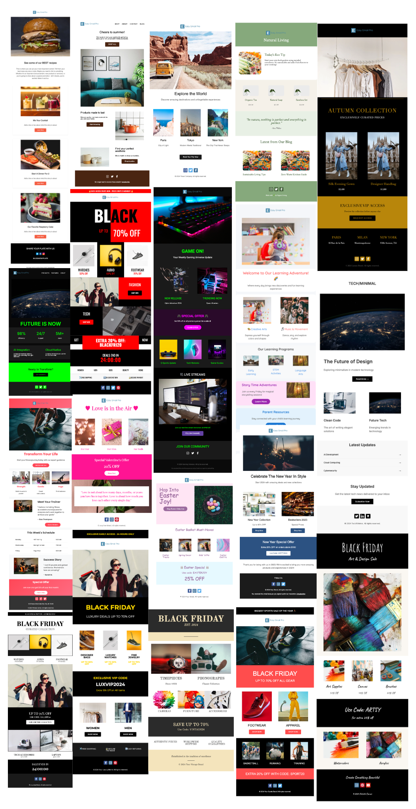

# Email Template Collection

A curated collection of responsive email templates built with MJML and HTML. These templates are designed to work across different email clients and devices.

## Live demo 
https://www.easyemail.pro/templates

## 🚀 Features

- Built with MJML for responsive design
- Tested across major email clients
- Easy to customize and maintain
- Clean and modern design
- Mobile-friendly layouts

## 📧 Templates Preview

## 🛠️ Usage

1. Choose a template from the collection
2. Customize the content using MJML or directly edit the HTML
3. Test your email using email testing tools
4. Deploy to your email service provider

## 📝 License

This project is open-sourced under the MIT License

